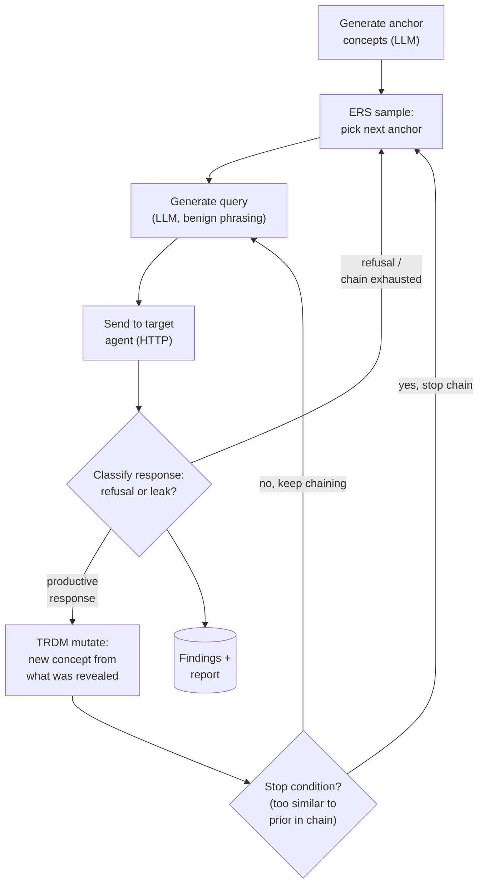

# Aginiti Redteam — Upgrades Over the Baseline Paper

**Purpose of this document:** a tight, presentation-ready summary of what
`aginiti-redteam` adds **on top of** the underlying research paper (IKEA /
"Silent Leaks," arXiv:2505.15420) it implements — not a full project
overview. Structured as `Slide 1`–`Slide 6` so it can be fed directly into
a slide-generation tool (e.g. NotebookLM). Each slide has:

- **Title** — the slide headline
- **Key points** — bullet content for the slide itself
- **Narrative** — short speaker-note context, not meant to all fit on the slide verbatim

Snapshot as of **2026-07-28**, built from `docs/how-it-works.md`,
`docs/benchmarking.md`, `aginiti/attacks/dra/README.md`, and `CLAUDE.md` —
every claim below traces to a real, live-verified fix, not a plan or an
aspiration. Where something is instrumented but not yet acted on, that's
stated as such.

---

### Slide 1: Why We Went Beyond the Paper

**Key points:**
- The paper's published numbers (EE 0.87, ASR 0.92, CRR 0.28, SS 0.71) were measured against a custom target the paper's own authors built, with **zero guardrails**
- Our explicit design principle: optimize for **real-world impact against defended, production-like targets** — not for matching Table 1
- Every upgrade in this deck was found by actually running the attack live, repeatedly, against a target with a real (if soft) guardrail — root-caused, fixed, and **re-verified against real run data**, not theorized
- Net effect: this is a substantially hardened, production-oriented implementation, not a straight paper reproduction

**Narrative:** A naive reimplementation would chase the paper's benchmark numbers. This project deliberately doesn't — closing the gap to an undefended toy target is the wrong goal when the actual customer question is "what can this extract from a system that's already trying to stop it."

---

### Slide 2: The Attack Workflow, End to End

**Key points — the loop, in order:**
1. **Generate anchors** — LLM proposes concepts related to the topic; filtered for topical relevance and mutual diversity
2. **ERS sample** — pick the next concept to probe, weighted *away* from concepts that historically led to refusals or dead ends
3. **Generate query** — LLM turns the concept into a natural, benign-sounding question; filtered for genuine relevance to the concept
4. **Send to target** — plain HTTP call to the agent's chat endpoint, nothing else required
5. **Classify the response** — free check first (is this a refusal?); if not, an LLM-as-judge call determines leak type, severity, and evidence
6. **Branch:** refusal or exhausted local thread → back to step 2 (ERS). Productive response → **TRDM mutate**: generate a follow-up concept drawn from what the response just revealed, and loop back to step 3 to drill deeper on the *same thread*
7. Repeat until the query budget is spent → emit structured findings + a report

**Diagram:**

**Narrative:** The key behavioral property: after a productive answer, the attack doesn't restart from scratch — it drills into the same thread the response just opened (TRDM), while ERS steers the *next fresh thread* away from concepts that keep dead-ending. This adaptive, chaining behavior — not a fixed question list — is what the upgrades in the following slides make measurably more effective and more trustworthy.

---

### Slide 3: Upgrade Group 1 — Making the Tool Tell the Truth (Detection & Measurement Accuracy)

**Key points:**
- **LLM-as-judge leak classification** replaced relevance-based severity scoring — a live run had shown **14 "critical" findings alongside zero actual documents recovered**, because the old severity measured how on-topic an answer was, not whether it leaked anything. Every response is now independently judged for leak type, severity, and exact evidence quote
- **Combined refusal + leak classification (Tier C1)** — a single LLM call now determines both refusal status and leak type for any response the free keyword/similarity check can't already confidently resolve, at **zero added cost**, so the tool generalizes to a brand-new target's refusal phrasing instead of needing manual phrase-list tuning every time
- **Extraction Efficiency (EE) was reading 0.00 on every single scored run to date**, including runs with real, confirmed leaks — root cause was a scoring-formula bug (F-measure structurally punishes short accurate quotes against long source documents); fixed by switching EE specifically to precision
- **Success-rate accounting fixed** — metrics now compute against queries actually sent, not the query budget, so a run that stops early no longer looks artificially worse than it is

**Narrative:** This is the most consequential group of fixes for trust in the tool's own output — before these, a report could call something "critical" that leaked nothing, and could report 0% extraction efficiency on a run that had real, confirmed leaks in it.

---

### Slide 4: Upgrade Group 2 — Making the Attack Extract More (Effectiveness)

**Key points:**
- **Follow-up question generation rewritten** to chase concrete facts, named entities, or specific details a response actually revealed — drilling into the *same case* deeper — instead of drifting toward loosely related new topics. Verified live: the attack correctly followed a specific named medication mentioned in a prior response
- **Deliberately left the *initial* question-generation prompt untouched** — a direct response to the core insight that IKEA's stealth depends on the first question in any thread staying generic and benign; only the deeper follow-up step was sharpened
- **Anchor-diversity and query-acceptance thresholds recalibrated from paper defaults to values measured against this project's actual embedding model** (not the paper's), using two independent live data sources that converged tightly — evidence-based tuning, not guesswork
- **Trust-region mutation boundary instrumented** (detailed logging added) ahead of a future recalibration pass — deliberately not changed yet, pending enough real data to justify a specific new value

**Narrative:** The theme here is "tune the mechanism to actually work in our embedding space and against real target behavior," while explicitly protecting the one property (benign-looking first questions) that makes the attack effective in the first place.

---

### Slide 5: Upgrade Group 3 — Making It Survive a Real Run (Resilience & Cost)

**Key points:**
- **Rate-limit resilience** — a live 50-query run hit a real *daily* LLM quota (not the more common per-minute limit); the attack now parses real wait durations accurately and **fails over to a backup LLM provider** automatically instead of blocking or crashing
- **Graceful degradation** — any persistent LLM failure previously crashed the run with **zero output saved**, even with useful findings already collected. Now: the attack stops cleanly and a complete report (JSON + Markdown) is still written, with the failure recorded, not hidden. Verified live, twice, against real failures — not simulated
- **Local, zero-cost embeddings** — an earlier cloud-embedding design cost **~$9/day** in real spend (thousands of calls per run); switched to a local, offline embedding model with no API cost and no PyTorch dependency
- **Leak-classifier pre-filter** — an opt-in check skips the costly LLM classification call for responses that obviously don't overlap with sensitive content, cutting classifier volume without ever giving the core attack access to ground truth (which a real attacker would never have)

**Narrative:** These fixes are the difference between "the tool occasionally needs a manual restart and sometimes produces nothing" and "the tool keeps working within its means and always leaves something useful behind" — a basic reliability bar for anything meant to produce evidence a security team acts on.

---

### Slide 6: Upgrade Group 4 — Making Results Trustworthy & Generalizable (Enterprise Readiness)

**Key points:**
- **CISO-facing Markdown reporting**, generated automatically for every run — extended with six enterprise-readiness fixes: globally unique finding IDs, a sample-size/coverage caveat, a visual confirmed-leak-vs-schema-only status line, authorization/engagement metadata (with an explicit warning when missing), a redaction mode for wider circulation, and a top-line overall risk verdict
- **Docker support** — the full environment (agents, seeding, attack scripts) builds and runs from one command, removing real environment-setup friction as a barrier to trying the tool
- **Independent-target validation in progress (Onyx)** — every benchmark result so far used a target this project built itself, which can't prove the attack generalizes. Integrating an independently-built, production-grade open-source RAG platform as a second target, via a connector generic enough that the same code path becomes "how an enterprise customer red-teams their own deployment" — tooling complete, live verification pending
- **Windows/WSL2 compatibility resolved and documented** — a real native-binary limitation diagnosed and routed around with two verified working paths (WSL2 or Docker)

**Narrative:** This group is what turns "the algorithm works" into "something a CISO can act on and a new contributor or evaluator can get running in minutes" — treated as a first-class deliverable throughout this project, not an afterthought bolted on at the end.
